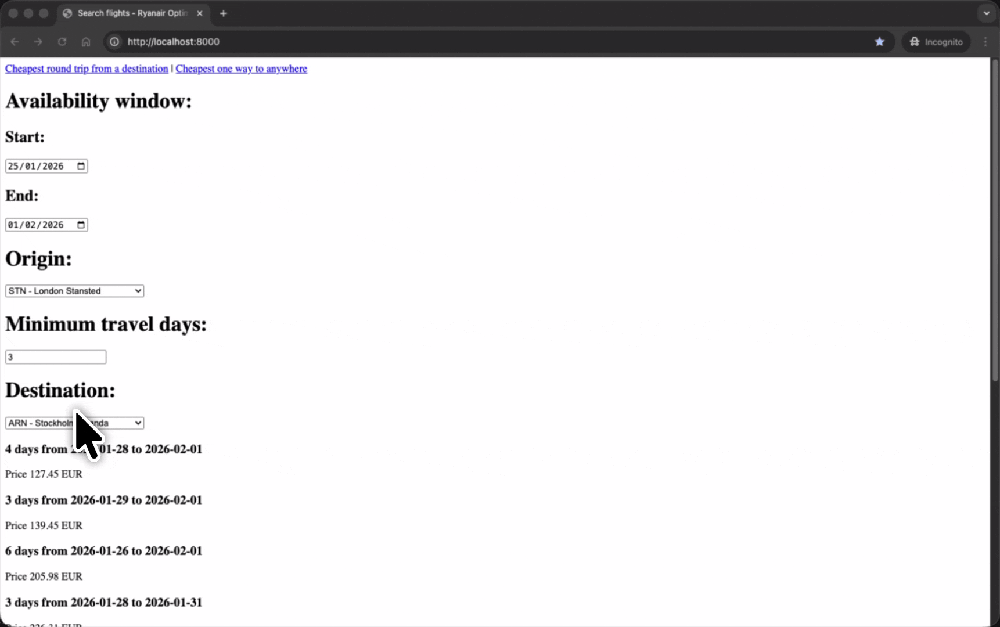

# Preview


# Features

- Find the cheapest one-way flights to anywhere for the current month.
- Find the cheapest round-trip flights to a specific destination within a selected date range.

# Setup Instructions

1. Clone the repository:
   ```bash
   git clone https://github.com/geraldkoh/ryanair-optimizer.git
   cd ryanair-optimizer/backend
   ```
2. Initialise `uv` and install dependencies:
   ```bash
   uv sync
   ```
3. Run the development server:
   ```bash
   uv run app
   ```
4. Open your browser and navigate to `http://localhost:8000` to access the application.

# Technical Overview

Frontend Features:

- [`HTMX`](https://htmx.org) and [`Jinja2`](https://jinja.palletsprojects.com/en/stable/) templating allows for dynamic and interactive user interfaces without full page reloads.

Backend Features:

- Asynchronous backend service using FastAPI, aiohttp, and asyncio.
- `uv` for Python package and project management.
- `ruff` for linting and code quality.
- `pre-commit` hooks for code quality and consistency.

# References:

https://www.postman.com/hakkotsu/ryanair/collection/dkwy055

# Disclaimer

For private, non-commercial use only. Comply with Ryanair’s ToS at your own risk.
